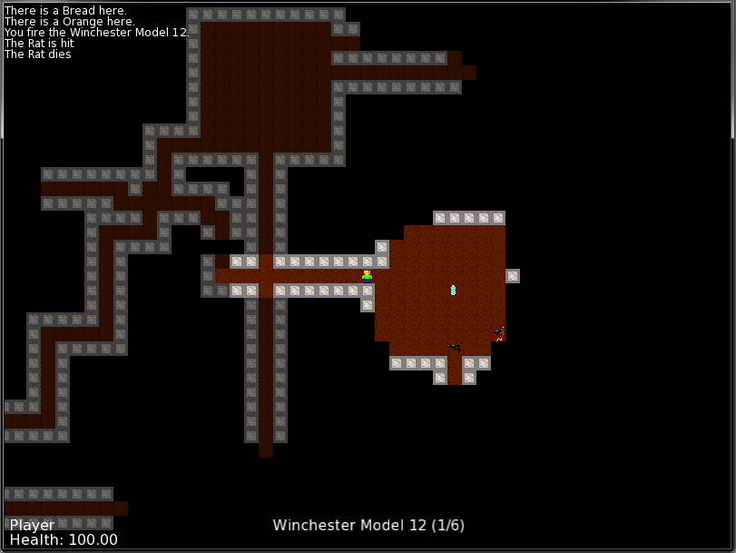

# About 

This is a roguelike style dungeon crawler game I've worked on for a while, written in C++
It uses SFML ( http://www.sfml-dev.org/ ) to draw, play audio etc. 

# Controls
Arrow keys to move
'Q' to equip an item
'G' to pick up an item
'D' to drop an item
'E' to eat an item
'F' to fire a ranged weapon

# Screenshot

